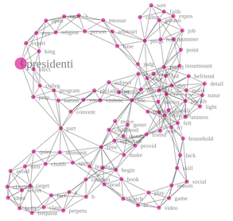
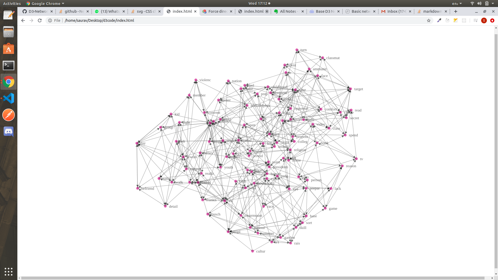

# D3-Network-graph
Clone the repository and run index.html in your browser that's it you are good to go.  

# D3-Network-directed-graph with arrow markers
clone the repo  
git checkout dev  
git pull  
run index.html on browser    

